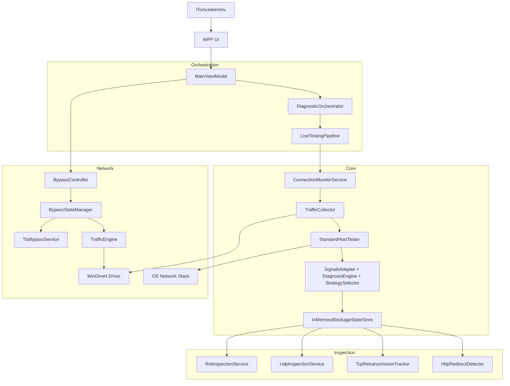

# ISP_Audit — Архитектура

**Версия документа:** 3.1 (Architecture Reference)
**Технологии:** .NET 9, WPF, WinDivert 2.2.0

> Этот документ — **стабильный архитектурный справочник**. Хронология изменений — в [CHANGELOG.md](CHANGELOG.md). Аудит кодовой базы — в [docs/full_repo_audit_intel.md](docs/full_repo_audit_intel.md). Задачи — в [docs/TODO.md](docs/TODO.md).

---

## 1. Обзор системы

**ISP_Audit** — инструмент сетевой диагностики для выявления и анализа блокировок трафика на стороне ISP. Работает на уровне перехвата пакетов (WinDivert), анализируя TCP/UDP соединения в реальном времени.

Смежный архитектурный набросок (draft): модель «сетевого портрета приложения» — `docs/network_portrait_architecture.md`.

### Ключевые задачи
1. **Пассивный мониторинг**: захват исходящих SYN (TCP) и первых датаграмм (UDP) без влияния на приложения.
2. **Активное тестирование**: независимые DNS / TCP / TLS / HTTP/3 (QUIC) проверки.
3. **Классификация блокировок**: DNS Spoofing, TCP RST Injection, HTTP Redirect, Packet Drop.
4. **Обход блокировок (Bypass)**: Fragmentation, Disorder, Fake TTL, Drop RST, QUIC→TCP.

---

## 2. Архитектура высокого уровня



---

## 3. Компоненты

### 3.1 UI Layer (WPF)

#### OperatorWindow (упрощённый интерфейс)

Wizard из 5 шагов: выбор приложения → источник трафика → прогресс → итог → исправление.
- По умолчанию приложение стартует в Operator UI.
- Переход в инженерный режим требует подтверждения (`state\ui_mode.json`).
- Shared `MainViewModel`, минимальные computed-статусы.
- UX-контракт: `docs/P1_11_operator_ui_contract.md`.
- История — список сессий (проверка → проблемы → действия → post-apply ретест), персист: `state\operator_sessions.json`.
- Header: ⚙️ `OperatorSettingsWindow` + ? `OperatorHelpWindow`.
- Эскалация ступенями: при `FAIL/PARTIAL` после ретеста — «Усилить» (safe-only: Disorder → DropRst → QUIC → AllowNoSNI).
- Откат «Откатить» — только Autopilot-изменения (snapshot ручного apply).

#### MainWindow (инженерный интерфейс)

- MaterialDesignInXaml, drawer-панель (закрепление + автосворачивание).
- Таблица результатов: 5 колонок (статус / SNI / GroupKey / стратегия / действие), детали по double-click.
- Агрегация подхостов по `UiKey` (groupKey / доменный суффикс), бейдж `×N`.
- Режим **Фокус**: только проблемные/активные/применённые строки + сводка «что применено».
- Пометка **APPLIED** работает аккумулятивно: бейджи IN/OUT/EXCLUDED.
- Кнопка «Снять всё (включая ручное)» с подтверждением → `RollbackAllAsync`.

#### MainViewModel

- Центральная ViewModel (shared между Operator/Engineer).
- Инициализирует `DiagnosticOrchestrator`, обрабатывает Start/Stop/Report.
- Подписка на смену сети: уведомление «Проверить/Отключить/Игнорировать» → staged revalidation.
- При закрытии: безопасный shutdown (отмена диагностики, выключение bypass, восстановление DNS/DoH из `state\dns_backup.json`).
- Crash-recovery: при старте проверяет backup от прошлой незавершённой сессии.
- Post-crash UX: баннер при наличии новых crash-reports (`state\crash_reports_seen.json`).
- Единственный экземпляр `MainViewModel` для обоих окон (без дублирования `TrafficEngine` и двойного shutdown).

#### BypassController

- Прокси к `BypassStateManager` / `TlsBypassService`.
- Тумблеры: Fragment / Disorder / Fake / Drop RST / DoH + assist-флаги (QUIC→TCP, No SNI).
- Пресеты фрагментации (стандарт/умеренный/агрессивный/профиль), автокоррекция — в сервисе.
- Метрики/вердикт приходят из событий `TlsBypassService`.
- Журнал транзакций Apply (вкладка «Применение»), дедуп по `(GroupKey + PlanText)`.
- Формат транзакции: `Request/Snapshot/Result` + `Contributions`.
- `BypassOperationContext` (AsyncLocal) для crash-корреляции.
- UI таблица активных FlowPolicy (matched/applied per-policy) + экспорт snapshot.
- Consent-gate: DNS/DoH — только при согласии пользователя (`state\operator_consent.json`).

#### BypassStateManager — единый владелец состояния bypass (SSoT)

- **Fail-safe**: журнал сессии (`state\bypass_session.json`), crash-recovery, watchdog (авто-Disable при пропаже heartbeat).
- **Activation Detection**: `ENGINE_DEAD / NOT_ACTIVATED / ACTIVATED / NO_TRAFFIC / UNKNOWN`.
- **Outcome Check (HTTPS)**: tagged probe (TCP+TLS+HTTP), probe исключается из пользовательских метрик.
- Сериализует `Apply/Disable`, guard на прямые вызовы вне manager-scope.

#### TestResultsManager

- `ObservableCollection<TestResult>`, обновления через Dispatcher.
- Декомпозирован на partial-файлы: Counters / Initialization / Update / PipelineParsing / Tokens / DnsResolution / Heuristics / Private.
- Top-level парсер: `ViewModels/PipelineMessageParser.cs` с явным контекстом `IPipelineMessageParserContext`.
- Smoke: `--ui-reducer-smoke` для проверки UI редьюсера без GUI.

#### Правила качества кода

- `Directory.Build.props` + `.editorconfig`, встроенные .NET analyzers.
- Non-UI слои: `CA2000` (dispose), `CA2200` (rethrow) как `warning`; `CA2007` как `suggestion`.
- Правило декомпозиции: файл > 500–700 строк → вынос (partial → отдельные классы/сервисы).

---

### 3.2 Orchestration Layer

#### DiagnosticOrchestrator

- Запускает/останавливает `LiveTestingPipeline` и фоновые сервисы.
- SNI из `DnsParserService` гейтятся по PID через корреляцию remote endpoint → `PidTrackerService.TrackedPids`.
- SNI не фильтруется `NoiseHostFilter` на входе (фильтрация — только при отображении OK).
- При UDP blockage устанавливает цель outcome для селективного `DropUdp443`.
- Критические секции сериализуются (Start/Cancel/Retest/Apply).
- Декомпозирован: Core / Monitoring / Recommendations / Recommendations.Apply / System / Private.

#### LiveTestingPipeline

- Асинхронный конвейер на `System.Threading.Channels` (bounded).
- Этапы: Sniffing → Testing → Classification → Reporting.
- `UnifiedTrafficFilter` — минимальная валидация (loopback).
- Гейтинг повторных тестов: `IBlockageStateStore.TryBeginHostTest(...)` (кулдаун + лимит).
- `[PipelineHealth]` — периодический лог со счётчиками.
- Параллельный Testing: `SemaphoreSlim` через `PipelineConfig.MaxConcurrentTests`.
- `AutoHostlistService` — кандидаты из `InspectionSignalsSnapshot`.
- UX-гейт: `OnPlanBuilt` публикуется для `FilterAction.Process` и `LogOnly`.

### 3.2.1 DPI Intelligence (INTEL)

Слой между диагностикой и обходом: Signals → Diagnosis → Selector → Plan → Manual Apply.

**Step 1 (Signals)**: `SignalsAdapter` пишет события в TTL-store (`InMemorySignalSequenceStore`). Факты инспекции — через `IInspectionSignalsProvider` → `InspectionSignalsSnapshot`.

**Step 2 (Diagnosis)**: `StandardDiagnosisEngine` по `BlockageSignals`. Пояснения — только из наблюдаемых фактов (без стратегий). Диагнозы: `ActiveDpiEdge`, `StatefulDpi`, `TlsInterference`, `QuicInterference`, `HttpRedirect`, `DnsHijack` и др.

**Step 3 (Selector/Plan)**: `StandardStrategySelector` строит `BypassPlan` по `DiagnosisId + Confidence`. Жёсткие защиты:
- `confidence < 50` → пустой план.
- `RiskLevel.High` запрещён при `confidence < 70`.
- Нереализованные стратегии → warning + skip.
- `TlsFragmentSizes` заполняются в плане детерминированно.
- Assist-флаги: `DropUdp443`, `AllowNoSni`.
- Phase 3 стратегии: `HttpHostTricks`, `QuicObfuscation`, `BadChecksum` — все implemented.

**Step 4 (Executor)**: `BypassExecutorMvp` — форматирование/логирование (без auto-apply). Реальный apply — через `BypassController.ApplyIntelPlanAsync(...)` → `Core/Bypass/BypassApplyService` (таймаут/отмена/rollback).

**Step 5 (Feedback)**: `JsonFileFeedbackStore` (`state\feedback_store.json`), ранжирование в селекторе.

**Контрактные константы**: окно агрегации 30/60с, TTL событий 10 мин.

**UI-гейт**: рекомендации принимаются только из строк `[INTEL]`. Legacy строки не обновляют `BypassStrategy`.

**Auto-apply** (опционально, через `EnableAutoBypass`): консервативный (confidence ≥ 70, safe-only, anti-storm cooldown+gate, DNS/DoH — только при consent).

### 3.2.2 Policy-Driven Execution (целевая модель)

**Принцип**: обход — функция от пакета, а не «состояние системы». WinDivert обрабатывает конкретный пакет с конкретными полями → решение PASS/BLOCK/MODIFY.

**Декомпозиция**:
- **Semantic Layer** (UI/группы/карточки): Service Group, вклады карточек.
- **Policy Layer** (`FlowPolicy`): декларативные правила «если match → action».
- **Decision Graph** (`DecisionGraphSnapshot`): быстрый lookup решения по признакам пакета.
- **Execution Plane** (WinDivert handlers/filters): обработка + одно решение.

**Модели**: `Core/Models/FlowPolicy.cs`, `MatchCondition.cs`, `PolicyAction.cs`, `DecisionGraphSnapshot.cs`.
**Компилятор**: `Core/Bypass/PolicySetCompiler.cs`.

**Feature Gates** (по умолчанию выключены):
| Этап | Feature Gate | Что подключено |
|------|-------------|----------------|
| 1 | `ISP_AUDIT_POLICY_DRIVEN_UDP443` | UDP/443 (QUIC→TCP) |
| 2 | `ISP_AUDIT_POLICY_DRIVEN_TTLBLOCK` | TTL endpoint block |
| 3 | `ISP_AUDIT_POLICY_DRIVEN_TCP80` | TCP/80 HTTP Host tricks |
| 4 | `ISP_AUDIT_POLICY_DRIVEN_TCP443` | TCP/443 TLS ClientHello |

**Semantic Groups**: `Core/Models/SemanticGroup.cs`, `Core/Bypass/SemanticGroupEvaluator.cs` — статус `NO_TRAFFIC / PARTIAL / ENABLED` по per-policy метрикам.

### 3.2.3 Service Groups (Accumulative Attachment Model)

Базовая единица управления обходом — **Service Group** (YouTube, Steam, …). Карточки — участники группы.

**Правила мержа**:
- Endpoints: union по всем attachments (IPv4/IPv6, TTL/cap).
- Assist-флаги: OR (если хотя бы одному нужен `QUIC→TCP` — включается).
- TLS-стратегия: per-policy (по dst_ip/proto/port/tls_stage через Decision Graph).

**Транзакция Apply**:
- Request: GroupKey, инициатор, причина.
- Snapshot: EffectiveGroupConfig + PolicyBundle + Contributions + FiltersActive + InputFacts.
- Result: Applied/Failed/RolledBack + тайминги.

**Участие**: `Core/Bypass/GroupBypassAttachmentStore` (`state\group_participation.json`), manual participation (IN/OUT), pinning (`hostKey → groupKey`).

**Доменные семейства**: анализатор на лету, каталог `state\domain_families.json` (pinned + learned).
**Кросс-доменные группы**: `state\domain_groups.json` (pinned: `group-youtube`, learned: co-occurrence).

---

### 3.3 Core Modules

| Компонент | Файл | Назначение |
|-----------|------|------------|
| `BlockageCode` | `Core/Diagnostics/BlockageCode.cs` | Нормализация кодов проблем + legacy алиасы |
| `PipelineContract` | `Core/Diagnostics/PipelineContract.cs` | Контрактные строки пайплайна |
| `TrafficCollector` | `Utils/TrafficCollector.cs` | Сбор соединений, дедуп по `RemoteIp:RemotePort:Protocol` |
| `StandardHostTester` | `Core/Modules/StandardHostTester.cs` | DNS → TCP → TLS → rDNS → HTTP/3 QUIC probe |
| `StandardBlockageClassifier` | `Core/Modules/StandardBlockageClassifier.cs` | Вердикт: DNS_BLOCKED / TCP_CONNECT_TIMEOUT / TCP_RESET / DPI_FILTER / FAKE_IP |
| `InMemoryBlockageStateStore` | `Core/Modules/InMemoryBlockageStateStore.cs` | История проверок + `IInspectionSignalsProvider` |

### 3.4 Inspection Services (параллельный глубокий анализ)

| Сервис | Что делает |
|--------|------------|
| `RstInspectionService` | Перехват TCP RST, сравнение TTL и IPID с эталоном → RST Injection |
| `UdpInspectionService` | Анализ UDP (QUIC/DNS), детект блокировки QUIC |
| `TcpRetransmissionTracker` | Подсчёт ретрансмиссий, сигнал Packet Drop при >10% |
| `HttpRedirectDetector` | HTTP 301/302/307, сравнение с blockpage-справочником |

### 3.5 Bypass Layer

#### TrafficEngine (`Core/Traffic/TrafficEngine.cs`)
- Обёртка WinDivert, управление фильтрами и инъекцией.
- Пассивные наблюдатели (`TrafficMonitorFilter`) **до** модифицирующих (`BypassFilter`).
- Crash-report: `state\crash_reports\traffic_engine\`.

#### TlsBypassService (`Bypass/TlsBypassService.*.cs`)
- SSoT для TLS обхода: применяет опции, пресеты, автокоррекцию.
- Регистрирует/удаляет `BypassFilter` в `TrafficEngine`.
- Partial-файлы: Engine / Metrics / Udp443 / Models / AutoAdjust.
- Метрики каждые 2с: ClientHello, фрагментации, RST.
- Вердикты: нет TLS / не 443 / короткий CH / мало данных / ratio RST.
- AutoAdjust (агрессивный пресет): RST burst → min chunk 4; зелёный >30с → уменьшение (не ниже 4).
- AutoTTL: перебор TTL 2..8, сохранение лучшего в `bypass_profile.json`.

#### BypassFilter (`Core/Traffic/Filters/BypassFilter.*.cs`)
- **Fragmentation**: ClientHello → 2+ TCP-сегмента по `TlsFragmentSizes`.
- **Disorder**: обратный порядок сегментов (корректные seq/len).
- **Fake TTL**: пакет с коротким TTL (дойдёт до DPI, не до сервера).
- **Drop RST**: отбрасывание релевантных входящих TCP RST.
- **HTTP Host Tricks**: сегментация `Host:` для TCP/80.
- **Bad Checksum**: инжект фейковых пакетов без пересчёта checksum.
- Гейтирование: только 443 + SNI + длина ≥ threshold (при `AllowNoSni` — без SNI тоже).
- Per-policy наблюдаемость: matched_count / applied_count.

#### QUIC→TCP (`DropUdp443`)

Два режима:
- **Селективный** (по цели): `BypassStateManager` → observed IPv4 (TTL/cap) → `BypassFilter` дропает UDP/443 только к этим IP.
- **Глобальный** (`DropUdp443Global`): весь UDP/443.

Для нескольких активных сервисов — union по целям. Реактивное обновление через `ReactiveTargetSyncService` (bounded-очередь + coalescing + retry-until-delivered).

IPv6: селективность недоступна, сохраняется drop при включённом `DropUdp443`.

---

## 4. Поток данных

1. **Захват**: `ConnectionMonitorService` фиксирует события/снимки соединений.
2. **Идентификация**: `PidTrackerService` определяет PID.
3. **Парсинг**: `DnsParserService` извлекает домен (DNS/SNI). SNI — по исходящему ClientHello с минимальным реассемблингом. SNI-кеш: first-wins (замена только шум → не-шум).
4. **Фильтрация**: `UnifiedTrafficFilter` — только loopback.
5. **Очередь**: хост → `LiveTestingPipeline`.
6. **Тестирование**: `StandardHostTester` (DNS/TCP/TLS/rDNS/H3), VPN-адаптивные таймауты.
7. **Инспекция**: параллельно RST/UDP/Retransmission/Redirect сервисы.
8. **Агрегация**: результаты → `HostTested`.
9. **INTEL**: Signals → Diagnosis → Selector → Plan → `OnPlanBuilt`.
10. **Классификация**: `StandardBlockageClassifier` → вердикт.
11. **Отчёт**: `TestResultsManager` → UI. `NoiseHostFilter` — только при отображении OK.
12. **Реакция**: manual apply → `BypassController.ApplyIntelPlanAsync(...)`, auto-apply (опционально) → пост-Apply ретест.

---

## 5. Структура проекта

```
ISP_Audit/
├── Program.cs                  # Точка входа (WPF, CodePages для OEM866)
├── App.xaml                    # Ресурсы приложения
├── Config.cs                   # Глобальные настройки
│
├── Core/                       # ЯДРО
│   ├── Interfaces/             # IHostTester, IBlockageClassifier
│   ├── Intelligence/           # DPI Intelligence INTEL
│   │   ├── Contracts/          # Signals/Diagnosis/Strategy (без зависимостей на UI/Bypass)
│   │   ├── Diagnosis/          # StandardDiagnosisEngine
│   │   ├── Execution/          # BypassExecutorMvp, TlsFragmentPlanParamsParser
│   │   ├── Feedback/           # JsonFileFeedbackStore
│   │   ├── Signals/            # SignalsAdapter + TTL store
│   │   └── Strategies/         # StandardStrategySelector
│   ├── Diagnostics/            # BlockageCode, PipelineContract
│   ├── Models/                 # HostDiscovered, TestResult, FlowPolicy, SemanticGroup
│   ├── Modules/                # StandardHostTester, StandardBlockageClassifier, InMemoryBlockageStateStore, Inspection services
│   ├── Bypass/                 # GroupBypassAttachmentStore, BypassApplyService, PolicySetCompiler
│   └── Traffic/                # TrafficEngine + Filters/BypassFilter
│
├── ViewModels/                 # MVVM
│   ├── MainViewModel.*.cs
│   ├── DiagnosticOrchestrator.*.cs
│   ├── OrchestratorState/      # PostApplyRetestState и др.
│   ├── BypassController.*.cs
│   ├── TestResultsManager*.cs
│   └── PipelineMessageParser.cs
│
├── Utils/                      # Вспомогательные
│   ├── LiveTestingPipeline.*.cs
│   ├── TrafficCollector.cs
│   ├── ConnectionMonitorService.cs
│   ├── DnsSnifferService.cs    # DnsParserService (DNS + SNI)
│   ├── PidTrackerService.cs
│   ├── FixService.cs           # DNS fix (netsh)
│   ├── EnvVar.cs               # Централизованное чтение ENV
│   ├── AppCrashReporter.cs
│   └── ReactiveTargetSyncService.cs
│
├── Bypass/                     # Bypass helpers
│   ├── BypassStateManager.*.cs # SSoT (partial-файлы)
│   ├── TlsBypassService.*.cs   # TLS bypass (partial-файлы)
│   ├── StrategyMapping.cs
│   └── WinDivertNative.cs      # P/Invoke
│
├── Windows/                    # Окна WPF
│   ├── OperatorWindow.xaml
│   ├── OperatorSettingsWindow.xaml
│   └── OperatorHelpWindow.xaml
│
├── native/                     # Нативные зависимости
│   └── isp_audit_native/       # Rust cdylib (заготовка WinDivert proxy)
│
├── state/                      # Runtime-состояние (рядом с приложением)
│   ├── apply_transactions.json
│   ├── bypass_session.json
│   ├── dns_backup.json
│   ├── domain_families.json
│   ├── domain_groups.json
│   ├── feedback_store.json
│   ├── group_participation.json
│   ├── operator_consent.json
│   ├── operator_sessions.json
│   ├── post_apply_checks.json
│   ├── blockpage_hosts.json
│   ├── ui_mode.json
│   ├── crash_reports_seen.json
│   └── crash_reports/          # app/ + traffic_engine/
│
├── TestNetworkApp/             # CLI smoke-раннер
│   └── Smoke/                  # SmokeTests.*.cs, SmokeRunner.cs
├── SmokeLauncher/              # UAC-запускатор smoke
├── ISP_Audit.Tests/            # xUnit unit-тесты
│
└── docs/                       # Документация
    ├── TODO.md
    ├── full_repo_audit_intel.md
    ├── ENV_VARS.md
    ├── P1_11_operator_ui_contract.md
    └── network_portrait_architecture.md
```

---

## 6. Переменные окружения

Полный реестр — `docs/ENV_VARS.md`. Чтение/парсинг — `Utils/EnvVar.cs`.

Тестовые хуки `ISP_AUDIT_TEST_*` работают **только в DEBUG**.

---

## 7. Smoke-тесты

CLI-раннер: `TestNetworkApp --smoke [all|infra|pipe|insp|ui|bypass|dpi2|orch|cfg|err|e2e|perf|reg]`.

| Флаг | Назначение |
|------|-----------|
| `--strict` / `--no-skip` | SKIP → FAIL |
| `--json <path>` | JSON-отчёт |

Авто-запуск с admin: `SmokeLauncher` (UAC elevation → `--smoke all --strict`).

Категории: INFRA, PIPE, INSP, UI, BYPASS, DPI2, ORCH, CFG, ERR, E2E, PERF, REG.

PERF: включает KPI `PERF-005` (10 последовательных Apply/Disable, p95 < 3с) и baseline `PERF-006` (latency `ProcessPacketForSmoke` p50/p95/p99 на 10K пакетов).

INFRA: включает стресс `INFRA-010` (1000 Apply/Rollback за <=60с).

---

## 8. Известные ограничения

| Компонент | Ограничение | Влияние |
|-----------|-------------|---------|
| WinDivert | Требует Администратора | UAC elevation обязателен |
| VPN | Конфликт TAP/TUN | Ложные срабатывания, трафик мимо WinDivert |
| Локализация | CP866 (OEM) | Кракозябры без `Encoding.GetEncoding(866)` |
| Размер | Single-file ~160MB | .NET Runtime + WPF в одном файле |
| DoH | Не перехватывает DoH | Зашифрованный DNS браузеров не виден |

---

## 9. Технический долг

1. **Глобальное состояние**: `Config.ActiveProfile`, `Program.Targets`, `NoiseHostFilter.Instance`.
2. **Отсутствие DI**: граф объектов вручную в `MainViewModel`.
3. **Жёсткие пути**: конкатенация строк для путей логов/профилей.
4. **Обработка ошибок**: `async void` в legacy ViewModel.

---

## 10. Roadmap

### Phase 4: Refactoring
- [ ] DI Container (`Microsoft.Extensions.DependencyInjection`)
- [ ] Устранение глобального состояния → `IConfigurationService`
- [ ] Unit Tests для `StandardBlockageClassifier`, `BypassFilter`

### Phase 5: Advanced Bypass
- [ ] Geneva Strategy (TCP Window manipulation)
- [ ] Auto-Tune параметров по реакции DPI

### Phase 6: UI/UX
- [ ] Real-time графики задержек/потерь
- [ ] Экспорт истории в PDF/HTML
