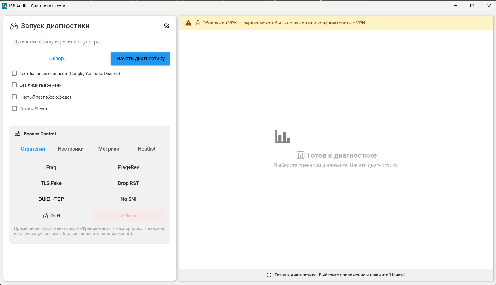

# ISP Audit

**Диагностика сетевых проблем и оптимизация соединения для игр и приложений**

Windows-приложение для анализа сетевого трафика, выявления проблем соединения (DNS, ошибки TLS, нестабильные TCP-сессии) и выдачи рекомендаций по оптимизации/стабилизации. Применение оптимизаций выполняется вручную (по кнопке/тумблерам) и требует запуска от администратора.


## Как это работает

1. **Выбираете .exe** игры или приложения
2. **Запускаете диагностику** — целевое приложение стартует автоматически
3. **Наблюдаете в реальном времени** как тестируются обнаруженные соединения
4. **Получаете результат** — какие хосты работают нестабильно и почему

По результатам диагностики формируются рекомендации v2. Оптимизация включается вручную — через тумблеры или кнопкой «Применить рекомендации v2» (доступно только при запуске от администратора).

## Интерфейс



## Возможности

### Live Testing Pipeline
- **Перехват трафика** через WinDivert (Socket + Network layer)
- **SNI-парсинг** — определение реальных доменов из TLS ClientHello
- **DNS-мониторинг** — захват DNS-запросов/ответов приложения
- **Параллельное тестирование** — проверка хостов по мере обнаружения
- **Продвинутая детекция**:
    - **HTTP Redirect** — обнаружение нетипичных перенаправлений
    - **RST Inspection** — анализ TTL и аномальных TCP RST
  - **TCP Retransmissions** — подсчет потерь пакетов
  - **Fail Counters** — анализ стабильности во времени
- **Классификация проблем**: DNS-ошибки, TCP-сбои, ошибки TLS, нетипичные HTTP-перенаправления

### Оптимизация соединения
- **Менеджер состояния оптимизаций** — единый владелец Apply/Disable, fail-safe, наблюдаемость
- **TrafficEngine + фильтр модификации трафика** — перехват/модификация пакетов (WinDivert wrapper)
- **TLS Fragmentation** — разбиение ClientHello для стабильности
- **TLS Disorder** — отправка фрагментов в обратном порядке (улучшает совместимость)
- **TLS Fake** — дополнительные пакеты для повышения стабильности
- **RST Drop** — фильтрация аномальных TCP RST пакетов
- **QUIC→TCP (Drop UDP/443)** — помогает откату с QUIC/HTTP3 на TCP/HTTPS (для IPv4 селективно по целевым IP)
- **Allow No SNI** — позволяет применять оптимизацию даже когда SNI не распознан/отсутствует
- **HTTP Host Compatibility** — TCP/80: разрез заголовка `Host:` на два TCP сегмента и drop оригинала
- **Bad Checksum** — фейковые TCP пакеты с испорченным checksum (для совместимости некоторых техник)
- **DoH (DNS-over-HTTPS)** — защищённый DNS через Cloudflare/Google/Quad9

### Отчётность
- Генерация профиля приложения (JSON)
- Подробный лог в `Logs/isp_audit_*.log`
- Статистика: хосты ✓/❌, задержки, типы проблем

## Установка

### Готовый exe (рекомендуется)
1. Скачайте `ISP_Audit.exe` из [Releases](https://github.com/Nafancheg/ISP_Audit/releases)
2. Скачайте [WinDivert 2.2](https://github.com/basil00/Divert/releases) и распакуйте `WinDivert64.sys` и `WinDivert.dll` рядом с exe
3. Запустите **от имени администратора** (требуется для WinDivert)

### Сборка из исходников

```powershell
# Требуется .NET 9 SDK
git clone https://github.com/Nafancheg/ISP_Audit.git
cd ISP_Audit

# Скачайте WinDivert 2.2 и распакуйте в native/
# - native/WinDivert64.sys
# - native/WinDivert.dll

# Соберите тестовое приложение (нужно для тестирования)
cd TestNetworkApp
dotnet publish -c Release -r win-x64 --self-contained false -o bin/Publish
cd ..

# Debug
dotnet build

# Release single-file
dotnet publish -c Release -r win-x64 /p:PublishSingleFile=true /p:SelfContained=true -o ./publish
```

### TestNetworkApp (для разработки)
`TestNetworkApp` используется в разработке в двух ролях:

1) Генератор сетевой активности (для воспроизводимых сценариев)
2) Runner smoke-тестов репозитория (CLI без GUI)

Генератор сетевой активности:
- Устанавливает соединения к 7 известным хостам (Google, YouTube, Discord, GitHub и др.)
- Работает 60 секунд с повторяющимися запросами
- Используйте как эталон для проверки захвата трафика

```powershell
# Сборка
cd TestNetworkApp
dotnet publish -c Release -r win-x64 --self-contained false -o bin/Publish

# Использование: в ISP Audit выберите TestNetworkApp\bin\Publish\TestNetworkApp.exe
```

Smoke-тесты (runner):

```powershell
# Все smoke-тесты (нестрогий режим)
dotnet run -c Debug --project TestNetworkApp\TestNetworkApp.csproj -- --smoke all

# Строгий режим (любые SKIP считаются ошибкой)
dotnet run -c Debug --project TestNetworkApp\TestNetworkApp.csproj -- --smoke all --strict

# Отчёт в JSON
dotnet run -c Debug --project TestNetworkApp\TestNetworkApp.csproj -- --smoke all --json artifacts\smoke_all.json
```

## Использование

### GUI (по умолчанию)

```powershell
# Запуск GUI
.\ISP_Audit.exe

# или из исходников
dotnet run
```

1. Нажмите **Обзор** и выберите .exe файл приложения
2. Нажмите **Запустить диагностику**
3. Приложение запустится автоматически
4. Используйте приложение как обычно — ISP Audit анализирует трафик в фоне
5. Закройте приложение или нажмите **Стоп** — получите результаты

Если диагностика выявила проблемы, откройте панель оптимизации и примените рекомендации v2 (или включите нужные тумблеры вручную).

### Overlay (мини-окно)
Во время диагностики отображается компактное окно поверх всех окон:
- Время сессии
- Количество соединений
- Кнопка остановки

### Результаты
После завершения:
- Профиль сохраняется в `Profiles/{AppName}_{timestamp}.json`
- Лог сессии в `Logs/isp_audit_vm_{timestamp}.log`

## Типы проблем

| Статус | Описание | Решение |
|--------|----------|--------|
| `TLS_AUTH_FAILURE` | Ошибка TLS рукопожатия (AuthenticationException) | Зависит от сценария (прокси/антивирус/фильтрация); часто помогает VPN |
| `TLS_HANDSHAKE_TIMEOUT` | TLS рукопожатие не завершается за таймаут | VPN / прокси |
| `TCP_CONNECTION_RESET` | Сброс соединения (TCP reset) | DROP_RST |
| `TCP_CONNECT_TIMEOUT` | TCP connect не завершается за таймаут | VPN / прокси |
| `DNS_ISSUE` | DNS-ошибка (пустой ответ/некорректный IP) | DoH |
| `HTTP_REDIRECT` | Нетипичный HTTP redirect | VPN / прокси |
| `TCP_RETRY_HEAVY` | Высокий % ретрансмиссий пакетов | VPN / Проверка канала |

## Архитектура

Подробное описание внутренних компонентов и актуальной схемы пайплайна — в `ARCHITECTURE_CURRENT.md`.

## Системные требования

- **ОС**: Windows 10/11 (x64)
- **Права**: Администратор (для WinDivert)
- **.NET**: 9.0 (включён в single-file exe)

## FAQ

**Q: Почему нужны права администратора?**
A: WinDivert — это kernel driver для перехвата пакетов. Без админ-прав он не запустится.

**Q: Влияет ли на другие приложения?**
A: Нет. Оптимизация применяется только к выбранному приложению (фильтрация по PID).

**Q: Безопасно ли это?**
A: Да. Приложение:
- Не отправляет данные в интернет
- Не модифицирует системные файлы
- Оптимизация отключается при закрытии ISP Audit

**Q: Что делать если "0 соединений"?**
1. Убедитесь что запустили от администратора
2. Убедитесь что приложение делает сетевые запросы
3. Попробуйте `ipconfig /flushdns` перед диагностикой

**Q: Hostname показывает технические имена (1e100.net)?**
A: Это reverse-DNS от Google CDN. SNI-парсинг показывает реальные домены, если они доступны в TLS ClientHello.

## Лицензия

MIT License. См. [LICENSE](LICENSE).

## Благодарности

- [WinDivert](https://github.com/basil00/Divert) — перехват пакетов
- [MaterialDesignInXaml](https://github.com/MaterialDesignInXAML/MaterialDesignInXamlToolkit) — UI компоненты

