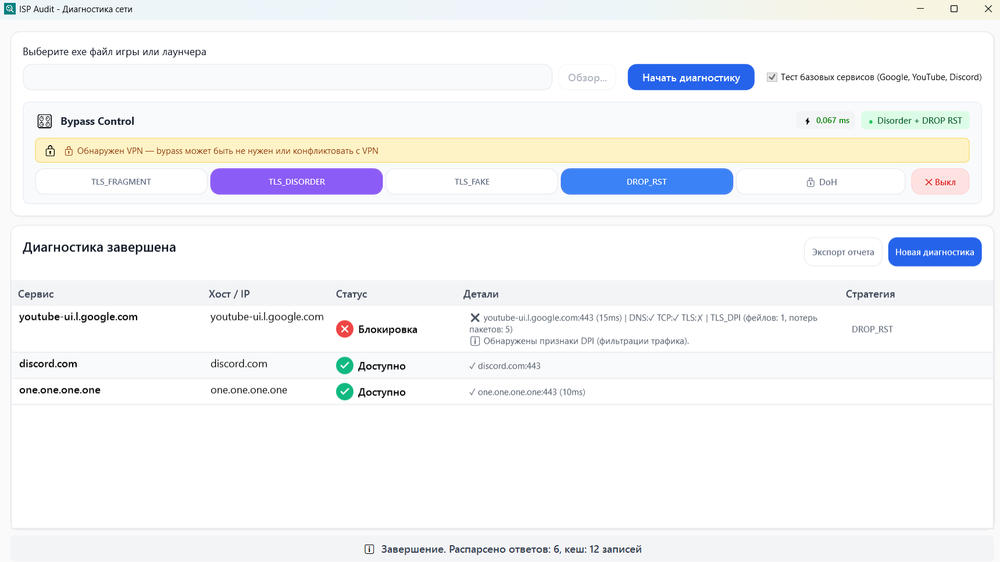

# ISP Audit

**Диагностика сетевых проблем и восстановление доступа для игр и приложений**

Windows-приложение для анализа сетевого трафика, выявления проблем соединения (DPI, DNS, нестабильные TCP-сессии) и их автоматического устранения. Работает с любым приложением — просто укажите .exe файл.


## Как это работает

1. **Выбираете .exe** игры или приложения
2. **Запускаете диагностику** — приложение стартует автоматически
3. **Наблюдаете в реальном времени** как тестируются обнаруженные соединения
4. **Получаете результат** — какие хосты работают нестабильно и почему

Оптимизация соединения включается автоматически при старте диагностики.

## Интерфейс



## Возможности

### Live Testing Pipeline
- **Перехват трафика** через WinDivert (Socket + Network layer)
- **SNI-парсинг** — определение реальных доменов из TLS ClientHello
- **DNS-мониторинг** — захват DNS-запросов/ответов приложения
- **Параллельное тестирование** — проверка хостов по мере обнаружения
- **Продвинутая детекция**:
  - **HTTP Redirect** — обнаружение "заглушек" провайдера
  - **RST Inspection** — анализ TTL для выявления DPI-инжектов
  - **TCP Retransmissions** — подсчет потерь пакетов
  - **Fail Counters** — анализ стабильности во времени
- **Классификация проблем**: `DNS_FILTERED`, `TLS_DPI`, `TCP_RST`, `TCP_TIMEOUT`, `HTTP_REDIRECT_DPI`

### Оптимизация соединения
- **TrafficEngine 2.0** — модульная архитектура на базе Chain of Responsibility
- **Performance Monitoring** — встроенный мониторинг задержек обработки пакетов (<0.5ms)
- **TLS Fragmentation** — разбиение ClientHello для стабильности
- **TLS Disorder** — отправка фрагментов в обратном порядке (улучшает совместимость)
- **TLS Fake** — дополнительные пакеты для повышения стабильности
- **RST Drop** — фильтрация аномальных TCP RST пакетов
- **DoH (DNS-over-HTTPS)** — защищённый DNS через Cloudflare/Google/Quad9

### Отчётность
- Генерация профиля приложения (JSON)
- Подробный лог в `Logs/isp_audit_*.log`
- Статистика: хосты ✓/❌, задержки, типы проблем

## Установка

### Готовый exe (рекомендуется)
1. Скачайте `ISP_Audit.exe` из [Releases](https://github.com/Nafancheg/ISP_Audit/releases)
2. Скачайте [WinDivert 2.2](https://github.com/basil00/Divert/releases) и распакуйте `WinDivert64.sys` и `WinDivert.dll` рядом с exe
3. Запустите **от имени администратора** (требуется для WinDivert)

### Сборка из исходников

```powershell
# Требуется .NET 9 SDK
git clone https://github.com/Nafancheg/ISP_Audit.git
cd ISP_Audit

# Скачайте WinDivert 2.2 и распакуйте в native/
# - native/WinDivert64.sys
# - native/WinDivert.dll

# Соберите тестовое приложение (нужно для тестирования)
cd TestNetworkApp
dotnet publish -c Release -r win-x64 --self-contained false -o bin/Publish
cd ..

# Debug
dotnet build

# Release single-file
dotnet publish -c Release -r win-x64 /p:PublishSingleFile=true /p:SelfContained=true -o ./publish
```

### TestNetworkApp (для разработки)
Тестовое приложение для калибровки и проверки работы ISP Audit:
- Устанавливает соединения к 7 известным хостам (Google, YouTube, Discord, GitHub и др.)
- Работает 60 секунд с повторяющимися запросами
- Используйте как эталон для проверки захвата трафика

```powershell
# Сборка
cd TestNetworkApp
dotnet publish -c Release -r win-x64 --self-contained false -o bin/Publish

# Использование: в ISP Audit выберите TestNetworkApp\bin\Publish\TestNetworkApp.exe
```

## Использование

### GUI (по умолчанию)

```powershell
# Запуск GUI
.\ISP_Audit.exe

# или из исходников
dotnet run
```

1. Нажмите **Обзор** и выберите .exe файл приложения
2. Нажмите **Запустить диагностику**
3. Приложение запустится автоматически
4. Используйте приложение как обычно — ISP Audit анализирует трафик в фоне
5. Закройте приложение или нажмите **Стоп** — получите результаты

### Overlay (мини-окно)
Во время диагностики отображается компактное окно поверх всех окон:
- Время сессии
- Количество соединений
- Кнопка остановки

### Результаты
После завершения:
- Профиль сохраняется в `Profiles/{AppName}_{timestamp}.json`
- Лог сессии в `Logs/isp_audit_vm_{timestamp}.log`

## Типы проблем

| Статус | Описание | Решение |
|--------|----------|--------|
| `TLS_DPI` | Проблемы с TLS handshake | TLS Fragmentation |
| `TLS_TIMEOUT` | TLS соединение зависает | DROP_RST |
| `TCP_RST` | Некорректные RST пакеты | DROP_RST |
| `TCP_TIMEOUT` | TCP соединение не устанавливается | VPN |
| `DNS_FILTERED` | DNS возвращает пустой ответ | DoH |
| `DNS_BOGUS` | DNS возвращает некорректный IP | DoH |
| `HTTP_REDIRECT_DPI` | Подмена HTTP-ответа провайдером | VPN / TTL Trick |
| `TCP_RETRY_HEAVY` | Высокий % ретрансмиссий пакетов | VPN / Проверка канала |

## Архитектура

```text
┌─────────────────────────────────────────────────────────────────────────────┐
│                        MainViewModelRefactored                              │
│                         (Тонкий координатор UI)                             │
└───────────────────────────────────┬─────────────────────────────────────────┘
                                    │
         ┌──────────────────────────┼──────────────────────────┐
         │                          │                          │
         ▼                          ▼                          ▼
┌─────────────────────┐  ┌─────────────────────┐  ┌─────────────────────┐
│  ConnectionOptimizer│  │DiagnosticOrchestrator│  │ TestResultsManager │
│                     │  │                     │  │                     │
│ • Toggle кнопки     │  │ • Lifecycle         │  │ • Результаты        │
│ • VPN детекция      │  │ • Координация       │  │ • Эвристики         │
│ • DoH управление    │  │ • Мониторинг        │  │ • UI обновления     │
└──────────┬──────────┘  └──────────┬──────────┘  └─────────────────────┘
           │                        │
           │             ┌──────────┴──────────────────────────┐
           │             │                                     │
           ▼             ▼                                     ▼
┌─────────────────────────────────────────────────────────────────────────────┐
│                               TrafficEngine                                 │
│                     (Chain of Responsibility Pipeline)                      │
│                                                                             │
│  ┌──────────────┐   ┌──────────────┐   ┌──────────────┐   ┌──────────────┐  │
│  │ WinDivert    │──►│ OptimizeFilter│──►│TrafficMonitor│──►│ WinDivert    │  │
│  │ Recv         │   │ (Modify/Drop)│   │Filter (Stats)│   │ Send         │  │
│  └──────────────┘   └──────────────┘   └──────────────┘   └──────────────┘  │
│                                                                             │
│  • Single Handle (No Race Conditions)                                       │
│  • Performance Metrics (<0.5ms latency)                                     │
└─────────────────────────────────────────────────────────────────────────────┘
```

### Ключевые компоненты

| Файл | Назначение |
|------|------------|
| `ViewModels/MainViewModelRefactored.cs` | Тонкий координатор UI |
| `ViewModels/BypassController.cs` | Управление стабилизацией соединения |
| `ViewModels/DiagnosticOrchestrator.cs` | Координация диагностики |
| `ViewModels/TestResultsManager.cs` | Результаты и эвристики |
| `Core/Traffic/TrafficEngine.cs` | Ядро обработки трафика (Pipeline) |
| `Core/Traffic/Filters/BypassFilter.cs` | Фильтр оптимизации пакетов |
| `Core/Traffic/Filters/TrafficMonitorFilter.cs` | Фильтр анализа трафика |
| `Utils/TrafficCollector.cs` | Сбор и обогащение соединений |
| `Utils/LiveTestingPipeline.cs` | Тестирование + классификация |
| `Utils/DnsParserService.cs` | Парсинг DNS и SNI |
| `Core/Modules/HttpRedirectDetector.cs` | Детекция HTTP-заглушек |
| `Core/Modules/RstInspectionService.cs` | Анализ RST-пакетов (TTL) |
| `Core/Modules/TcpRetransmissionTracker.cs` | Подсчет ретрансмиссий |
| `Core/Modules/InMemoryBlockageStateStore.cs` | Агрегация сигналов и истории |
| `Bypass/BypassCoordinator.cs` | Автовыбор методов оптимизации |

## Системные требования

- **ОС**: Windows 10/11 (x64)
- **Права**: Администратор (для WinDivert)
- **.NET**: 9.0 (включён в single-file exe)

## FAQ

**Q: Почему нужны права администратора?**  
A: WinDivert — это kernel driver для перехвата пакетов. Без админ-прав он не запустится.

**Q: Влияет ли на другие приложения?**  
A: Нет. Оптимизация применяется только к выбранному приложению (фильтрация по PID).

**Q: Безопасно ли это?**  
A: Да. Приложение:
- Не отправляет данные в интернет
- Не модифицирует системные файлы
- Оптимизация отключается при закрытии ISP Audit

**Q: Что делать если "0 соединений"?**  
1. Убедитесь что запустили от администратора
2. Убедитесь что приложение делает сетевые запросы
3. Попробуйте `ipconfig /flushdns` перед диагностикой

**Q: Hostname показывает технические имена (1e100.net)?**  
A: Это reverse-DNS от Google CDN. SNI-парсинг показывает реальные домены, если они доступны в TLS ClientHello.

## Лицензия

MIT License. См. [LICENSE](LICENSE).

## Благодарности

- [WinDivert](https://github.com/basil00/Divert) — перехват пакетов
- [MaterialDesignInXaml](https://github.com/MaterialDesignInXAML/MaterialDesignInXamlToolkit) — UI компоненты
 
