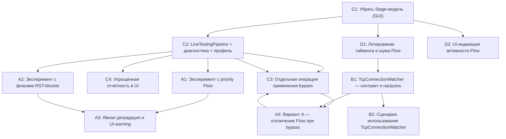

## Граф зависимостей (Mermaid)


## Подзадачи Фазы 1

### C1. Убрать Stage-модель из GUI (Группа C, приоритет: критично)
**Статус: ВЫПОЛНЕНО**
**Описание:**
Переход от трёхшаговой Stage‑модели к единой кнопке «Запустить диагностику» для exe‑сценария. Удалить Stage1/Stage2/Stage3 команды/статусы и соответствующие элементы UI, оставить один упрощённый диагностический поток.

**Входы:**
- `ViewModels/MainViewModel.cs` — свойства/команды `Stage1*`, `Stage2*`, `Stage3*`, `EnableLiveTesting`, текущая логика запуска exe‑сценария.
- `MainWindow.xaml` — кнопки и элементы разметки, привязанные к Stage‑состояниям и прогрессу.
- `agents/research_agent/findings.md` — разделы про Stage‑модель и единый пайплайн.
- `docs/bypass_architecture_deep_dive.md` — шаг 1 Фазы 1 (упрощение модели шагов).

**Выходы:**
- Обновлённый `MainViewModel` без Stage‑специфичных свойств/команд; добавлен единый вход `RunDiagnosticPipelineCommand`/`RunDiagnosticPipelineAsync`.
- Обновлённый `MainWindow.xaml` с одной основной кнопкой «Запустить диагностику» и без Stage‑карт/кнопок.
- При необходимости — вспомогательные enum/свойства `DiagnosticPhase`, `DiagnosticStatus`, отражающие упрощённые этапы пайплайна.

**Оценка:** 3–4 часа.

**Зависимости:** нет (стартовая подзадача).

**Риски:**
- Лёгко сломать существующий exe‑workflow, если удалить Stage‑логику без эквивалентной замены.
- Возможны скрытые привязки в XAML/командах, которые перестанут работать.

**Минимизация рисков:**
- Делать удаление поэтапно: сначала пометить Stage‑свойства/команды как «неиспользуемые» и убедиться, что они не дергаются из XAML/кода.
- Временно сохранить «технический» статус диагностики (один прогресс‑бар, один текст статуса), чтобы не ломать все привязки сразу.

**Критерии приёмки:**
- В GUI для exe‑сценария есть ровно одна основная кнопка «Запустить диагностику» (нет Stage1/2/3).
- Приложение компилируется, XAML‑биндинги не выбрасывают ошибок в рантайме.
- При нажатии кнопки вызывается новый единый entry‑point (пока можно запускать старую последовательность захвата/LiveTesting/AuditRunner, но уже без отдельных кнопок).

---

### C2. LiveTestingPipeline = диагностика + создание профиля (Группа C, приоритет: критично)
**Статус: ВЫПОЛНЕНО**
**Описание:**
Сделать `LiveTestingPipeline` основным диагностическим механизмом для exe‑сценария: он тестирует обнаруженные хосты, классифицирует проблемы и **формирует bypass‑профиль** (без применения на лету). Убрать дублирование через `AuditRunner` в exe‑workflow и отключить `EnableAutoBypass`.

**Реализация:**
- Внедрена модульная архитектура (`Core/Interfaces`, `Core/Modules`).
- `LiveTestingPipeline` использует `IHostTester`, `IBlockageClassifier`, `IBypassEnforcer`.
- Реализована поддержка Fallback IP через `TargetCatalog`.
- `EnableAutoBypass` отключен по умолчанию.

**Входы:**
- `Utils/LiveTestingPipeline.cs` — `PipelineConfig`, воркеры, `TestHostAsync`, `ClassifyBlockage`, `UiWorker`, `ApplyBypassAsync`.
- `Utils/TrafficAnalyzer.cs` — создание `LiveTestingPipeline` внутри `AnalyzeProcessTrafficAsync`, текущие вызовы, передача хостов.
- `AuditRunner.cs` — определение, где он используется в exe‑сценарии (через `MainViewModel`) и как дублирует LiveTesting.
- `ViewModels/MainViewModel.cs` — место интеграции exe‑сценария с LiveTesting/AuditRunner.
- `docs/bypass_architecture_deep_dive.md` 15.1, разделы про «единый пайплайн» и «диагностика → профиль».

**Выходы:**
- Обновлённый `PipelineConfig` с `EnableAutoBypass=false` по умолчанию и без применения обхода в `UiWorker`.
- Новый метод в `LiveTestingPipeline`, например `BuildBypassProfile()` или накопитель профиля на основе событий `HostBlocked`.
- Обновлённая интеграция в `TrafficAnalyzer`/`MainViewModel`:
  - `LiveTestingPipeline` запускается автоматически вместе с захватом.
  - По завершении сессии/по команде есть готовый `BypassProfile` (в памяти и/или в файле `bypass_profile_*.json`).
- Исключение/отключение вызова `AuditRunner` из exe‑сценария (но **не** из классического профильного аудита).

**Оценка:** 3–4 часа.

**Зависимости:**
- C1 (единая точка входа в exe‑диагностику).

**Риски:**
- Потеря текущих возможностей `AuditRunner` для exe‑сценария (если он покрывал что‑то, чего нет в LiveTesting).
- Перемешивание ответственности: `TrafficAnalyzer` слишком плотно завязан на `LiveTestingPipeline`.
- Возможны сложности с формированием профиля (агрегация по хосту, протоколу, порту).

**Минимизация рисков:**
- Сначала реализовать `BuildBypassProfile()` параллельно с существующим `ApplyBypassAsync`, не ломая старую логику, затем отключить автоприменение.
- Сравнить результаты LiveTesting и `AuditRunner` на одном и том же наборе хостов в тестовом режиме (для QA‑чек‑листа).

**Критерии приёмки:**
- В ходе exe‑диагностики `LiveTestingPipeline` тестирует хосты и даёт список проблемных (BLOCKED/WARNING).
- По окончании диагностики доступен сформированный `BypassProfile` (как минимум в памяти, желательно в файле).
- Bypass нигде не применяется автоматически во время захвата (нет вызовов `EnableAsync/ApplyBypassAsync` из пайплайна без явной пользовательской команды).

---

### C3. Применение bypass как отдельная операция (Группа C, приоритет: критично после C1–C2)
**Статус: ВЫПОЛНЕНО**
**Описание:**
Ввести отдельный шаг «Применить обход» после успешной диагностики и формирования профиля: остановить захват/Flow, инициализировать `WinDivertBypassManager` с профилем, показать пользователю инструкции по перезапуску целевого приложения.

**Реализация:**
- `WinDivertBypassManager` создается в `MainViewModel` и передается в `TrafficAnalyzer`/`LiveTestingPipeline`.
- Реализована логика `FixType.Bypass` в `MainViewModel`.
- Добавлена поддержка стратегий `DROP_RST` и `TLS_FRAGMENT` через `ApplyBypassStrategyAsync`.
- Реализован откат (Disable) через `RollbackFixAsync`.

**Входы:**
- `ViewModels/MainViewModel.cs` — новая команда/метод `ApplyBypassAsync`, текущая логика взаимодействия с `WinDivertBypassManager` (если есть).
- `Bypass/WinDivertBypassManager.cs` — `EnableAsync`, `DisableAsync`, `ApplyBypassStrategyAsync`, `Initialize`, работа с профилями.
- Результаты C2 — формат и место хранения `BypassProfile`.
- `docs/bypass_architecture_deep_dive.md` — разделы про двухфазный workflow и «bypass не на лету».
- `agents/research_agent/findings.md` — раздел «Решение (утверждено пользователем)» по UX.

**Выходы:**
- Новая команда/кнопка в GUI «Применить обход», доступная только если есть готовый `BypassProfile` и по результатам диагностики есть проблемы.
- Реализация `ApplyBypassAsync` в `MainViewModel`, которая:
  - Останавливает текущую диагностическую сессию (см. A4/D1).
  - Инициализирует/запускает `WinDivertBypassManager` с профилем.
  - Обновляет статус UI («Обход активен. Перезапустите [название приложения]»).

**Оценка:** 2–3 часа.

**Зависимости:**
- C2 (наличие профиля).
- A4 (механика остановки Flow/захвата перед включением bypass).

**Риски:**
- Неправильное управление жизненным циклом WinDivert (двойной запуск, неосвобождённые handle’ы).
- Пользователь может применить обход без актуального профиля или без перезапуска приложения.

**Минимизация рисков:**
- Жёстко проверять наличие валидного профиля и не давать нажать кнопку в иных ситуациях.
- Явно отображать состояние bypass (`BypassActive`, `BypassProfileName`).

**Критерии приёмки:**
- После завершения диагностики при наличии проблем появляется кнопка «Применить обход».
- Нажатие кнопки останавливает захват и запускает `WinDivertBypassManager` с профилем.
- В UI явно указано, что для применения обхода нужно перезапустить целевое приложение.

---

### C4. Упрощённая отчётность и визуализация результатов (Группа C, приоритет: средний)
**Статус: ВЫПОЛНЕНО**
**Описание:**
Перестроить отчётность в GUI под единый пайплайн: простой прогресс, итоговое резюме (сколько хостов OK/BLOCKED/WARNING), список с иконками и минималистичные сообщения, без Stage‑специфики.

**Реализация:**
- Реализован метод `GenerateReport` в `MainViewModel`, создающий JSON-отчет.
- `ProgressStepper` заменен на стандартный `ProgressBar` для поддержки большого количества целей.
- Терминология "Тест" заменена на "Диагностика".
- Кнопка "Подробно" теперь доступна всегда для завершенных тестов.

**Входы:**
- `ViewModels/MainViewModel.cs` — текущие свойства `Stage1HostsFound`, `Stage2ProblemsFound`, прочие статусные поля.
- `MainWindow.xaml` и контролы `ProgressStepper`, `TestCard.xaml` — текущая визуализация этапов и результатов.
- `Utils/LiveTestingPipeline.cs` — выходные модели/события (успех/блокировка).
- Результаты C1–C2 — новая модель единого пайплайна.

**Выходы:**
- Новые свойства в `MainViewModel`, например: `TotalConnectionsCaptured`, `TotalHostsTested`, `HostsOk`, `HostsBlocked`, `HostsWarning`, `DiagnosticSummaryText`.
- Обновлённая разметка в `MainWindow.xaml`:
  - Один общий прогресс‑бар диагностики.
  - Список хостов с иконками ✓/✗/⚠ и короткими описаниями.
  - Итоговый блок «Итог: X OK, Y заблокировано, Z со предупреждениями».

**Оценка:** 2–3 часа.

**Зависимости:**
- C2 (источники данных по результатам тестов).

**Риски:**
- Потеря полезных деталей из старых отчётов, к которым привык пользователь.
- Переполнение UI (слишком много строк/хостов в списке).

**Минимизация рисков:**
- Сохранить возможность открытия подробного отчёта (например, текст/JSON), но упростить основной экран.
- Ограничить вывод по количеству хостов или группировать их.

**Критерии приёмки:**
- На основном экране exe‑диагностики пользователь видит:
  - общую строку статуса,
  - прогресс‑бар,
  - итоговое резюме и список хостов с минимумом шума.

---

### D1. Диагностика тайминга и шума Flow (Группа D, приоритет: низкий–средний)
**Статус: ВЫПОЛНЕНО ✅ (22.11.2025)**

**Описание:**
Добавить лог‑метрики для Flow‑слоя и минимальный сценарий «прогрева»: явный прогрев драйвера Flow через `TestNetworkApp` **до** запуска основной exe‑диагностики, фиксация таймингов открытия handle и первых целевых событий, оценка «шума» (общее/целевое количество flow'ов) и вынос фильтра Flow в конфигурируемую точку.

**Реализация (архитектурный рефакторинг):**

1. **Извлечение сервисов мониторинга:**
   - `Utils/FlowMonitorService.cs` — независимый сервис для Flow layer с событиями `OnFlowEvent`
   - `Utils/NetworkMonitorService.cs` — независимый сервис для Network layer с событиями `OnPacketReceived`
   - `Utils/DnsParserService.cs` — подписывается на NetworkMonitorService, парсит DNS ответы в кеш
   - `Utils/PidTrackerService.cs` — динамическое отслеживание PIDs (main + children), интервал 500ms

2. **Синхронизация готовности:**
   - Добавлен `TaskCompletionSource<bool>` в FlowMonitorService/NetworkMonitorService
   - `StartAsync()` теперь ждет открытия WinDivert handle перед возвратом
   - Гарантирует что warmup запускается **после** открытия слоев

3. **Метрики и логирование:**
   - `FlowOpenedUtc` — таймстемп открытия Flow handle
   - `FirstEventUtc` — таймстемп первого события + дельта в мс
   - `TotalEventsCount` — счетчик всех Flow событий
   - Статистика в TrafficAnalyzer: `получено Flow событий=X, совпадений PID=Y, уникальных соединений=Z`

4. **Прогрев Flow:**
   - TestNetworkApp запускается **после** открытия FlowMonitor/NetworkMonitor
   - Его трафик детектируется (~200ms первое событие)
   - Результаты в логах подтверждают готовность системы

5. **Исправление критичных багов:**
   - **IP byte order**: Добавлен `BitConverter.GetBytes + Array.Reverse` для корректной конверсии uint → IPAddress
   - **DNS кеш**: Передача через `new ConcurrentDictionary<string, string>(dnsParser.DnsCache)` вместо IReadOnlyDictionary
   - **PID tracking**: TrafficAnalyzer использует `pidTracker.TrackedPids` напрямую вместо статичной копии
   - **Многопоточность**: WMI запросы для child PIDs выполняются параллельно через `Task.WhenAll`

**Результаты тестирования:**
```
[17:59:07.461] [FlowMonitor] ✓ Flow layer открыт (Utc=2025-11-22T11:59:07.4454337Z)
[17:59:07.462] [NetworkMonitor] ✓ Network layer открыт
[17:59:07.655] [FlowMonitor] Первое событие через 207ms
[17:59:44.250] [TrafficAnalyzer] Новое соединение #1: 192.168.1.1:53 (pid=7940)
[18:01:00.651] [TrafficAnalyzer] Статистика: получено Flow событий=146, совпадений PID=52, уникальных соединений=11
[18:01:00.651] ✓ Hostname resolved: 11/11 (DNS-кеш: 11, reverse: 0)
```

**Оценка времени:** ~6 часов (вместо 1 часа из-за архитектурного рефакторинга).

**Зависимости:** C1 (единый запуск диагностики) — выполнено.

**Критерии приёмки:** ✅ Все выполнено
- В логах `debug_trace.log` есть понятные записи о старте Flow, первом целевом событии и количестве к нему относящихся flow'ов.
- При нескольких запусках можно увидеть, стартует ли Flow до начала сетевой активности целевого приложения.
- IP адреса корректны (не перевернуты байтами).
- DNS кеш работает (11/11 resolved из 91 записи).
- Динамическое отслеживание PIDs с задержкой не более 500ms.

**Примечания:**
- NetworkMonitor сейчас открывается только для DNS (UDP:53) для экономии ресурсов.
- FlowLayer дает все метаданные соединений (IP:Port:Protocol), NetworkLayer используется только для hostname resolution.
- Если потребуется DPI/packet inspection — фильтр NetworkMonitor можно расширить на TCP:443, TCP:80 и т.д.

---
- `Utils/TrafficAnalyzer.cs` — `AnalyzeProcessTrafficAsync`, `RunFlowMonitor`, места инициализации WinDivert Flow handle; использование `DebugLogger`.
- `docs/bypass_architecture_deep_dive.md` 15.1.2 — требования к логированию `FlowHandleOpenedUtc`, `FirstTargetFlowUtc`, `TotalFlows`, `TargetPidFlowsPercent`.
- `agents/research_agent/findings.md` — раздел «Риск 1a: Диагностика Flow-слоя и момент старта».

**Выходы:**
- Расширенное логирование в `TrafficAnalyzer`:
  - таймстемп открытия Flow‑handle (`FlowHandleOpenedUtc`) при успешном `WinDivertOpen` + вывод текущего `FlowFilter`,
  - таймстемп первого целевого Flow‑события (`FirstTargetFlowUtc`) и дельта в миллисекундах от момента открытия handle,
  - итоговое сообщение с количеством всех Flow‑событий (`TotalFlows`) и совпадающих с целевыми PID (`TargetPidFlows`) и их процентом (только в debug‑лог, без влияния на UI),
  - вынесенная строка `FlowFilter` в отдельную константу/настройку (пока `"true"` по умолчанию, с TODO на конфиг/профиль).
- Минимальный сценарий прогрева Flow для dev/QA:
  - `TestNetworkApp` переводится на один короткий прогон (одна итерация по целям),
  - в exe‑workflow (через `MainViewModel`/exe‑сценарий) добавляется шаг прогрева: **до** запуска основной диагностики вызывается `TestNetworkApp.exe` (один прогон),
  - прогрев выполняется **до** вызова `TrafficAnalyzer.AnalyzeProcessTrafficAsync` для целевого процесса, поэтому соединения `TestNetworkApp` не попадают в `GameProfile`, а используются только для проверки того, что Flow ловит события и виден в `debug_trace.log`.

**Оценка:** 1 час.

**Зависимости:**
- Желательно после C1 (единый запуск диагностики), но до тяжёлых изменений в A/B.

**Риски:**
- Логи могут стать слишком шумными.
- Ошибки в фильтре Flow могут привести к потере нужных событий.

**Минимизация рисков:**
- Делать логирование опциональным (флаг конфигурации).
- Сначала просто добавить метрики без изменения фильтра, затем аккуратно вводить фильтрацию.

**Критерии приёмки:**
- В логах `debug_trace.log` есть понятные записи о старте Flow, первом целевом событии и количестве к нему относящихся flow’ов.
- При нескольких запусках можно увидеть, стартует ли Flow до начала сетевой активности целевого приложения.

---

### D2. UI-индикация активности Flow/захвата (Группа D, приоритет: низкий–средний)
**Статус: ЧАСТИЧНО (логика готова, UI binding требует доработки)**

**Описание:**
Добавить простую визуальную индикацию того, что Flow‑слой реально видит соединения (а не молчит), например счётчик соединений/Flow‑событий и короткий текстовый статус.

**Текущая реализация:**
- TrafficAnalyzer выводит в прогресс: `[TrafficAnalyzer] Новое соединение #N: IP:Port (proto=X, pid=Y)`
- Периодический статус каждые 10 секунд: `Захват активен (44с), соединений: 8`
- Итоговая статистика: `получено Flow событий=146, совпадений PID=52, уникальных соединений=11`

**Что осталось:**
- Добавить свойства `FlowEventsCount` и `ConnectionsDiscovered` в `MainViewModel` с привязкой к UI
- Реализовать подписку MainViewModel на события FlowMonitorService для обновления счетчиков в реальном времени
- Добавить XAML binding: «Flow событий: N | Соединений: M»

**Оценка:** 1 час.

**Входы:**
- `ViewModels/MainViewModel.cs` — текущие свойства, связанные с захватом и прогрессом.
- `MainWindow.xaml` — диагностическая панель exe‑сценария.
- Результаты D1 — новые счётчики/метрики из `TrafficAnalyzer`.

**Выходы:**
- Свойства `FlowEventsCount` и/или `ConnectionsDiscovered` в `MainViewModel`.
- Простейшая привязка в `MainWindow.xaml`: «Обнаружено соединений: N».

**Оценка:** 1 час.

**Зависимости:**
- D1 (или хотя бы базовые счётчики Flow).

**Риски:**
- Несоответствие между счётчиками UI и деталями в логах.

**Минимизация рисков:**
- Держать обновление UI и логирование на одном и том же источнике счётчика.

**Критерии приёмки:**
- В GUI видно динамически растущее число обнаруженных соединений (при активном трафике).
- Значения коррелируют с логами Flow.

---

### A1. Эксперимент с приоритетами Flow layer (Группа A, приоритет: критично, но короткая экспериментальная задача)
**Описание:**
Поменять приоритет Flow‑handle на низкий (например, −1000) и проверить, влияет ли это на возможность открытия RST‑blocker (без изменения флагов), чтобы быстро проверить гипотезу о приоритетах.

**Входы:**
- `Utils/TrafficAnalyzer.cs` — строка/место, где открывается Flow handle с `priority=0`.
- `Bypass/WinDivertBypassManager.cs` — место открытия RST‑blocker (priority=0, Layer.Network).
- `agents/research_agent/findings.md` — обсуждение варианта C (разведение приоритетов).

**Выходы:**
- Модифицированное значение `priority` для Flow handle (например, −1000).
- Комментарий/логика (в findings/QA), повлияло ли это на частоту ошибок открытия RST‑blocker.

**Оценка:** 0.5 часа.

**Зависимости:**
- C2 (наличие воспроизводимого сценария диагностики и профиля).

**Риски:**
- Практической пользы может не быть (по документации `priority` не должен влиять на сам факт открытия).

**Минимизация рисков:**
- Отделить эксперимент в отдельную ветку/флаг, легко откатывать.

**Критерии приёмки:**
- Есть измеримый результат: либо явное снижение частоты ошибок открытия RST‑blocker, либо зафиксированный вывод, что метод не помогает.

---

### A2. Эксперимент с флагами RST-blocker (Группа A, приоритет: критично)
**Описание:**
Изменить флаги открытия RST‑blocker с `Sniff | Drop` на более безопасный режим (например, `0` с обработкой в `PumpPackets`) и проверить, открывается ли handle устойчиво рядом с Flow.

**Входы:**
- `Bypass/WinDivertBypassManager.cs` — `Initialize`, `TryOpenWinDivert`, места, где задаются флаги и фильтр `tcp.Rst == 1`, реализация `PumpPackets`.
- Документация WinDivert по флагам `Sniff`, `Drop`, `RecvOnly`, `None`.
- `agents/research_agent/findings.md` — варианты B/C и обсуждение рисков очередей.

**Выходы:**
- Изменённые флаги и при необходимости переработанный `PumpPackets` (чтобы drop происходил через отсутствие реинжекта).
- Логи/метрики: частота успешного открытия хэндла, количество обработанных RST.

**Оценка:** 1 час.

**Зависимости:**
- Желательно после C2 (единый сценарий для воспроизведения) и после A1 (приоритеты).

**Риски:**
- При неверной логике `PumpPackets` можно перестать дропать RST или, наоборот, нарушить обычный трафик.

**Минимизация рисков:**
- Начать с чисто диагностической конфигурации на тестовом стенде (не в прод‑режиме у пользователя).

**Критерии приёмки:**
- RST‑handle стабильно открывается (значительно меньше ошибок), при этом RST по‑прежнему дропаются в нужных сценариях.

---

### A3. Явная деградация и UI-warning при отсутствии RST-blocker (Группа A, приоритет: критично)
**Описание:**
Если RST‑blocker не открылся или упал, это должно отражаться в состоянии bypass и UI: обход считается активным, но **без RST‑защиты**, с чётким предупреждением пользователю.

**Входы:**
- `Bypass/WinDivertBypassManager.cs` — обработка результата `TryOpenWinDivert` для RST‑handle, текущие WARNING‑логи.
- `ViewModels/MainViewModel.cs` — свойства `BypassActive`, потенциальное новое `HasRstProtection`, `BypassWarningText`.
- `MainWindow.xaml` — место для отображения предупреждения.

**Выходы:**
- Явный канал статуса из `WinDivertBypassManager` (успешность открытия RST‑blocker) до ViewModel.
- UI‑элемент, показывающий предупреждение вида «Обход активен без RST‑защиты (возможны разрывы соединений)».

**Оценка:** 1–2 часа.

**Зависимости:**
- A1/A2 (понятна новая модель открытия/флагов).
- C3 (кнопка «Применить обход» и режим активного bypass).

**Риски:**
- Дублирование/засорение UI предупреждениями.

**Минимизация рисков:**
- Показ предупреждения только в активном режиме bypass и только если RST‑blocker реально не работает.

**Критерии приёмки:**
- При любой неудаче открытия RST‑blocker приложение не «молчит»: есть явное UI‑сообщение и статус, что обход частичный.

---

### A4. Вариант A — отключение Flow при включении bypass (Группа A, приоритет: критично, но после B1)
**Описание:**
Реализовать жёсткий вариант A: перед запуском bypass (WinDivertBypassManager) полностью остановить захват и закрыть Flow‑handle, чтобы устранить конфликт слоёв.

**Входы:**
- `Utils/TrafficAnalyzer.cs` — добавляемый метод `StopAsync()`/эквивалент для закрытия Flow/DNS handle’ов и завершения фоновых задач.
- `ViewModels/MainViewModel.cs` — интеграция `StopAsync()` в `ApplyBypassAsync`.
- `Bypass/WinDivertBypassManager.cs` — предпосылка, что при отсутствии Flow RST‑blocker открывается стабильно.
- Результаты B1 (наличие TcpConnectionWatcher как fallback для PID‑привязки).

**Выходы:**
- Реализованный чистый стоп‑процесс для захвата трафика (без утечек handle’ов и зависаний).
- Перед включением bypass вызывается этот стоп‑процесс.

**Оценка:** 2–3 часа.

**Зависимости:**
- B1 (альтернатива Flow для PID‑привязки).
- C3 (общий UX применения обхода).

**Риски:**
- Во время активного bypass GUI теряет live‑обновления списка соединений (если нет TcpConnectionWatcher).
- Ошибки в `StopAsync` могут оставить «полузакрытые» ресурсы и мешать повторным запускам.

**Минимизация рисков:**
- Чётко логировать этапы остановки и результаты закрытия handle’ов.
- Ввести отдельный UI‑режим «Активный обход» без списка соединений.

**Критерии приёмки:**
- При каждом применении обхода Flow‑handle гарантированно закрыт.
- Конфликт RST vs Flow не воспроизводится.

---

### B1. TcpConnectionWatcher — контракт и нагрузка (Группа B, приоритет: средний)
**Описание:**
Спроектировать и реализовать компонент `TcpConnectionWatcher`, использующий `GetExtendedTcpTable`/`GetExtendedUdpTable` для получения снимков соединений и их привязки к PID без участия Flow‑слоя.

**Входы:**
- `docs/bypass_architecture_deep_dive.md` 15.1.3 — требования к PID‑привязке и ограничению по целевым процессам.
- `Utils/TrafficAnalyzerDualLayer.cs` — `PopulateExistingFlows`, пример использования `GetExtendedTcpTable`.
- `Utils/TrafficAnalyzer.cs` — текущие места, где PID берётся из Flow.

**Выходы:**
- Новый файл `Utils/TcpConnectionWatcher.cs` с интерфейсом уровня:
  - `Task<Dictionary<ConnectionKey,int>> GetSnapshotAsync(CancellationToken)` или эквивалент, где `ConnectionKey` описывает (Local/Remote IP/port + Proto).
- Оценка нагрузки: измеренные (в логах) задержки и CPU при частоте опроса ~500 мс на ~1000 соединений.

**Оценка:** 3–4 часа.

**Зависимости:**
- D1 (понимание текущей роли Flow и статистики).

**Риски:**
- Высокая нагрузка/лаг при слишком частом опросе на системах с большим количеством соединений.

**Минимизация рисков:**
- Гибкий интервал опроса (конфиг).
- Ограничение списка процессов (только целевые exe).

**Критерии приёмки:**
- На тестах видно, что watcher корректно находит TCP‑соединения целевого процесса с задержкой ≤1–2 сек и без заметных лагов в UI.

---

### B2. Сценарии использования TcpConnectionWatcher в exe-сценарии (Группа B, приоритет: средний)
**Описание:**
Определить и задокументировать, как `TcpConnectionWatcher` будет использоваться в двух режимах: «diagnostic only» (Flow+watcher) и «active bypass» (Flow off, только watcher/WinDivert).

**Входы:**
- `Utils/TrafficAnalyzer.cs` — текущий захват и места, где нужна PID‑привязка.
- `ViewModels/MainViewModel.cs` — ожидания GUI: какие данные о соединениях отображаются.
- Результаты B1 (интерфейс и характеристики watcher).

**Выходы:**
- Обновлённая архитектурная схема/описание (можно в `agents/research_agent/findings.md` или отдельном doc), показывающая, в каких режимах используется Flow, watcher и WinDivert.
- Закреплённое решение: какие части GUI и LiveTesting опираются только на `TcpConnectionWatcher` (особенно в режиме активного bypass).

**Оценка:** 1–2 часа (анализ + документация).

**Зависимости:**
- B1.

**Риски:**
- Неполное покрытие всех мест, где сейчас implicitly используется Flow‑PID.

**Минимизация рисков:**
- Поиск по коду всех упоминаний `ProcessId`/`Flow.ProcessId` и явная карта зависимостей.

**Критерии приёмки:**
- Есть понятная документация, по которой Coding/QA‑агенты знают, какие данные брать в каком режиме работы, и как это влияет на UX.

---

## Чек-лист для QA Agent

После каждой подзадачи:

- **C1:**
  - Проверить отсутствие Stage‑кнопок/текстов в GUI.
  - Нажать «Запустить диагностику» и убедиться, что приложение не падает, диагностика стартует.

- **C2:**
  - Запустить диагностику с LiveTesting для тестового процесса с известными заблокированными и незаблокированными хостами.
  - Убедиться, что по окончании диагностики присутствует формируемый `BypassProfile` (в памяти/файле) и bypass **не** активируется сам.

- **C3:**
  - После C2 выполнить цикл: диагностика → «Применить обход».
  - Проверить, что захват останавливается, bypass активируется, UI показывает соответствующий статус и инструкцию.

- **C4:**
  - Во время диагностики и после неё проверить:
    - отображение прогресса,
    - резюме по количеству OK/BLOCKED/WARNING хостов,
    - список хостов с иконками.

- **D1:**
  - Включить подробное логирование и провести одну сессию;
  - убедиться, что в логах есть таймстемпы открытия Flow, первые целевые события и числа `TotalFlows`/`TargetPidFlows`.

- **D2:**
  - Запустить диагностику; при активном трафике целевого процесса проверить растущий `ConnectionsDiscovered`/`FlowEventsCount` в UI.

- **A1/A2:**
  - На повторяемом стенде измерить частоту ошибок открытия RST‑blocker до/после изменений.
  - Убедиться, что для синтетически воспроизведённого DPI‑RST сценария RST по‑прежнему блокируются (или зафиксировать, что эксперимент только диагностический).

- **A3:**
  - Смоделировать ситуацию, когда RST‑blocker не открывается (искусственно или реальным конфликтом).
  - Проверить, что в UI появляется явное предупреждение и статус обхода «без RST‑защиты».

- **A4:**
  - В сценарии применения обхода убедиться, что Flow‑handle закрыт (по логам/отсутствию Flow‑событий).
  - Убедиться, что RST‑blocker открывается успешно и нет конфликтных ошибок.

- **B1/B2:**
  - С включённым `TcpConnectionWatcher` проверить, что для целевого процесса его основные соединения появляются в снапшотах с задержкой ≤2 сек.
  - В режиме с отключённым Flow проверить, что GUI/диагностика используют только данные watcher и остаются работоспособными.

После полной Фазы 1:

- Пройти сценарий «диагностика → профиль → применение → перезапуск приложения» и убедиться, что:
  - UX соответствует описанному в `bypass_architecture_deep_dive.md` (одна кнопка диагностики, отдельная кнопка применения обхода).
  - При активном bypass не видно конфликтов Flow vs RST.
  - Отчётность в UI понятна и непротиворечива.

## Fallback-стратегия

- Если **C1/C2** (единый пайплайн + создание профиля) реализовать не удаётся в полном объёме:
  - Оставить минимальный вариант: одна кнопка запускает старую Stage‑цепочку, но с выключенным авто‑bypass и без повторного вызова `AuditRunner` (по возможности).
  - Сохранить Stage‑кнопки как «расширенный режим» через скрытый флаг, не показывая их основному пользователю.

- Если **A1/A2** не улучшают ситуацию с RST‑blocker:
  - Зафиксировать в документации результат эксперимента и перейти к A4 (жёсткое отключение Flow) как основному способу добиться стабильности.

- Если **A4** (выключение Flow) сильно ухудшает UX (пользователь не готов жить без live‑обновлений):
  - Временно приостановить A4 в основной ветке, использовать его только в «экспертном» режиме.
  - Ускорить внедрение B1/B2 (`TcpConnectionWatcher`) и D2 (UI‑индикация режима «Active Bypass»).

- Если **B1** (`TcpConnectionWatcher`) оказывается слишком тяжёлым по нагрузке:
  - Снизить частоту опроса, фильтровать по конкретным PID/портам.
  - Ограничить использование watcher только режимом «Active Bypass`, оставив Flow для диагностического режима.

## Промпт для Coding Agent

> Coding Agent. Возьми подзадачу **[ID] [Название]** из `agents/planning_agent/plan.md` и реализуй её **строго в рамках описания** (без захвата других подзадач).
> 
> 1. Внимательно прочитай раздел подзадачи (Описание, Входы, Выходы, Оценка, Зависимости, Риски, Критерии приёмки).
> 2. Убедись, что все зависимости для этой подзадачи уже выполнены (по git/по факту кода). Если нет — зафиксируй, что блокирует работу, и ничего не ломай.
> 3. Работай экономно (Haiku):
>    - читай только указанные файлы;
>    - меняй только те файлы, которые перечислены в «Выходы»;
>    - строго следуй асинхронным правилам (ConfigureAwait(false), CancellationToken).
> 4. По завершении:
>    - обнови соответствующий раздел `agents/qa_agent/test_report.md` с указанием, какие проверки из чек-листа выполнены;
>    - кратко опиши в `agents/task_owner/current_task.md`, что именно сделано по подзадаче [ID];
>    - не трогай другие подзадачи и не выполняй refactor вне рамок плана.
> 
> Начни с подзадачи **C1**.
